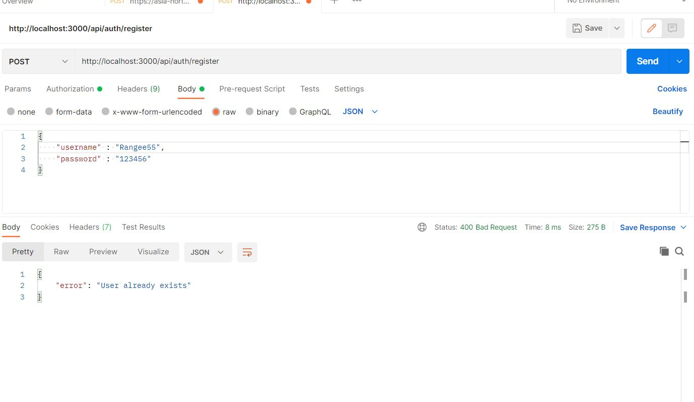

# Bookstore API

I built a RESTful API using Node.js and Express for a Bookstore app. It should support CRUD 
operations, file-based data persistence, and token-based user authentication. 

## SETUP instructions | Testing Endpoints

Installed Packages- `express jsonwebtoken bcryptjs uuid fs`

-First of all you must need to have [Nodejs](https://nodejs.org/en) installed in your system,then clone this repo
1. Cd in bookstore-api directory Run the command on Vs code or other terminal then `npm install`  to install packages then `node app.js` to start the application
2. You may use POSTMAN or THUNDERCLIENT to test The API and all of the requests.
3. Test the API endpoints and requests respectively using Postman
   You need to be logged in to view the books.
   If you are not registered register yourself then login
   Register(POST)- `http://localhost:3000/api/auth/login`
   body(JSON) - `{ "username" : "username" , "password" : "password"}`
   Then login(POST) with the registered credentials `http://localhost:3000/api/auth/register` You will recieve a token
4. You need to be logged in to test other endpoints. Provide the Bearer
   token you get after logging in to test other endpoints

   1. Fetch List of all books(GET)- `http://localhost:3000/api/books`
   2. Get book by ID(GET)- `http://localhost:3000/api/books/:id`
   3. Add a new book(POST)- `http://localhost:3000/api/books/` 
      Provide body with book details example is below
    ```JSON
      {
    "title" : "Gullivers Travels",
    "author" : "Jonathan Swift",
    "genre" : "Thriller",
    "publishedYear" : 1820
     }
    ```
    The added book will be saved to books.json as
    ```JSON
     {
    "id": "auto-generated UUID",
    "title": "String",
    "author": "String",
    "genre": "String",
    "publishedYear": "Number",
    "userId": "ID of user who added the book"
    }
    ```

   4. Update a book by ID(PUT)-`http://localhost:3000/api/books/:id`
      Send this PUT request with id of the book you want to update and 
      recieve the required book in the response and update it accordingly.Only user who added the book can update that book.
    ``` JSON
    {
    "title": "String",
    "author": "String",
    "genre": "String",
    "publishedYear": "Number",
    }
    ```
  5. Delete a book by ID(DELETE)- `http://localhost:3000/api/books/:id`
     Send this DELETE request with id of the book you want to delete.
     Only user who added the book can delete it


## Working 

   1. register. Registered username cannot be reused
          

   2.  login. Recieve token after login
             
        if login info is incorrect then get message 'invalid credentials'
          
   3.  Without authoriztion you cannot get list of all books
                
       With auth you can get list of all books by providing Bearer Token
          
   4.   You can get a book by its UUID
          

   5.  if the data type while adding book is incorrect book wont be added.it will throw an error
          
        ```JSON  
        {
            "error": "Invalid book data. title, author, and genre must be strings. publishedYear must be a number."
        }
        ```
        if the data type is correct then book will be added successfully
        
    6. You can only update your youn books i.e a user can only update books added by him/her using respective token
        
    7. You can only delete your youn books i.e a user can only delete books added by him/her using respective token
        


## Contributing

Pull requests are welcome. For major changes, please open an issue first
to discuss what you would like to change.

Please make sure to update tests as appropriate.

